# GADA Hiring Platform — V3 Schema Design Document

**Status**: Canonical design reference  
**Author**: Architect agent  
**Date**: 2026-04-01  
**Applies to**: PostgreSQL 16, V3 migration (builds on V1 + V2)

---

## Table of Contents

1. [Domain Boundaries](#1-domain-boundaries)
2. [Mermaid ERD](#2-mermaid-erd)
3. [Table-by-Table Explanation (V3 New Tables)](#3-table-by-table-explanation-v3-new-tables)
4. [Cross-Cutting Conventions](#4-cross-cutting-conventions)
5. [Index Strategy](#5-index-strategy)
6. [Audit Strategy](#6-audit-strategy)
7. [Region Master Strategy](#7-region-master-strategy)
8. [Multilingual Content Strategy](#8-multilingual-content-strategy)

---

## 1. Domain Boundaries

### Identity & Auth
**Tables**: `users`, `worker_profiles`, `employer_profiles`

Owns the core identity of every actor in the system — Firebase authentication anchor, role assignment, profile metadata, and work-eligibility data (visa, health check). **Invariant**: a `user_id` must appear in exactly one of `worker_profiles` or `employer_profiles` based on the `users.role` column; a single user cannot hold both profiles simultaneously.

### Organization
**Tables**: `companies`, `sites`, `regions`

Represents the physical and legal structure of the demand side — registered companies, their construction sites, and the geographic master data used to place those sites. **Invariant**: a `site` must belong to a verified `company`; `regions` rows are insert-only reference data managed by migrations, never by user actions.

### Workforce
**Tables**: `teams`, `team_members`

Models the supply-side groupings workers form to bid collectively on jobs. **Invariant**: `teams.member_count` must equal the count of active (non-left) rows in `team_members`; every team must have exactly one member with `role = 'LEADER'` at all times.

### Jobs
**Tables**: `job_categories`, `jobs`, `job_allowed_application_types`, `job_intro_contents`, `faqs`

Owns the posting lifecycle from draft to archival, the taxonomy of construction trades, and the editorial content (intro pages, FAQ) associated with those trades. **Invariant**: a job can only accept application types that exist in its `job_allowed_application_types` rows; `job_category_id` must reference an active (non-deleted) category.

### Matching
**Tables**: `applications`, `application_members`, `application_status_history`, `scouts`, `contracts`

Manages the full lifecycle of supply meeting demand — from first contact (scout or self-apply), through status transitions, to a signed contract. **Invariant**: an application's `application_type` must match the populated FK (individual vs. team vs. company); only one active application per `(job_id, applicant)` tuple is permitted at a time.

### Comms & Audit
**Tables**: `notifications`, `sms_templates`, `sms_send_logs`, `audit_logs`

Handles all outbound communication to users (in-app push, SMS) and provides the immutable audit trail for compliance and debugging. **Invariant**: `sms_send_logs` rows are append-only; `audit_logs` rows are never updated or deleted.

### Assets
**Tables**: `portfolios`, `portfolio_images`, `certifications`, `equipment_master`, `worker_equipments`, `team_equipments`, `visa_types`

Holds all structured credential, capability, and media data that workers and teams attach to their profiles to demonstrate competency. **Invariant**: a `portfolio` must have exactly one owner — either `worker_profile_id` or `team_id`, never both and never neither; `equipment_master` and `visa_types` are reference tables managed only by migrations or admin tooling.

---

## 2. Mermaid ERD

```mermaid
erDiagram
    users {
        bigserial id PK
        uuid public_id UK
        varchar phone UK
        varchar firebase_uid UK
        user_role role
        user_status status
        timestamptz created_at
        timestamptz updated_at
        timestamptz deleted_at
    }

    worker_profiles {
        bigserial id PK
        uuid public_id UK
        bigint user_id FK
        varchar full_name
        date birth_date
        varchar profile_image_url
        varchar nationality
        visa_type visa_type
        health_check_status health_check_status
        date health_check_expiry
        jsonb languages
        jsonb desired_job_categories
        integer desired_pay_min
        integer desired_pay_max
        pay_unit desired_pay_unit
        boolean is_public
        text bio
        timestamptz created_at
        timestamptz updated_at
        timestamptz deleted_at
    }

    employer_profiles {
        bigserial id PK
        uuid public_id UK
        bigint user_id FK
        bigint company_id FK
        varchar full_name
        varchar position
        employer_role role
        timestamptz created_at
        timestamptz updated_at
        timestamptz deleted_at
    }

    companies {
        bigserial id PK
        uuid public_id UK
        varchar name
        varchar business_registration_number UK
        varchar ceo_name
        varchar address
        varchar phone
        varchar email
        varchar website_url
        text description
        varchar logo_url
        company_status status
        timestamptz verified_at
        timestamptz created_at
        timestamptz updated_at
        timestamptz deleted_at
    }

    regions {
        bigserial id PK
        varchar sido
        varchar sigungu
        varchar dong
        varchar code UK
    }

    sites {
        bigserial id PK
        uuid public_id UK
        bigint company_id FK
        bigint region_id FK
        varchar sido
        varchar sigungu
        varchar name
        varchar address
        varchar address_detail
        decimal latitude
        decimal longitude
        text description
        site_status status
        date start_date
        date end_date
        timestamptz created_at
        timestamptz updated_at
        timestamptz deleted_at
    }

    job_categories {
        bigserial id PK
        uuid public_id UK
        varchar code UK
        varchar name_ko
        varchar name_en
        varchar name_vi
        text description_ko
        text description_en
        text description_vi
        varchar icon_url
        bigint parent_id FK
        integer sort_order
        boolean is_active
        timestamptz created_at
        timestamptz updated_at
        timestamptz deleted_at
    }

    jobs {
        bigserial id PK
        uuid public_id UK
        bigint site_id FK
        bigint company_id FK
        bigint job_category_id FK
        varchar title
        text description
        integer required_count
        integer pay_min
        integer pay_max
        pay_unit pay_unit
        jsonb visa_requirements
        jsonb certification_requirements
        jsonb equipment_requirements
        boolean health_check_required
        jsonb nationality_requirements
        boolean always_open
        date start_date
        date end_date
        job_status status
        integer view_count
        integer application_count
        timestamptz published_at
        timestamptz created_at
        timestamptz updated_at
        timestamptz deleted_at
    }

    job_allowed_application_types {
        bigserial id PK
        bigint job_id FK
        application_type application_type
    }

    job_intro_contents {
        bigserial id PK
        uuid public_id UK
        bigint category_id FK
        varchar locale
        varchar title
        varchar subtitle
        text body
        varchar hero_image_url
        boolean is_published
        timestamptz created_at
        timestamptz updated_at
        timestamptz deleted_at
    }

    faqs {
        bigserial id PK
        uuid public_id UK
        varchar category
        varchar locale
        text question
        text answer
        integer sort_order
        boolean is_published
        timestamptz created_at
        timestamptz updated_at
        timestamptz deleted_at
    }

    teams {
        bigserial id PK
        uuid public_id UK
        varchar name
        bigint leader_id FK
        team_type team_type
        bigint company_id FK
        varchar intro_short
        text intro_long
        jsonb intro_multilingual
        boolean is_nationwide
        jsonb regions
        integer member_count
        team_status status
        timestamptz created_at
        timestamptz updated_at
        timestamptz deleted_at
    }

    team_members {
        bigserial id PK
        bigint team_id FK
        bigint user_id FK
        team_member_role role
        varchar nationality
        visa_type visa_type
        health_check_status health_check_status
        date health_check_expiry
        varchar profile_image_url
        timestamptz joined_at
        timestamptz left_at
    }

    applications {
        bigserial id PK
        uuid public_id UK
        bigint job_id FK
        application_type application_type
        bigint applicant_user_id FK
        bigint team_id FK
        bigint company_id FK
        application_status status
        text cover_letter
        text employer_note
        bigint reviewed_by FK
        timestamptz reviewed_at
        timestamptz created_at
        timestamptz updated_at
        timestamptz deleted_at
    }

    application_members {
        bigserial id PK
        bigint application_id FK
        bigint user_id FK
        varchar full_name
        varchar nationality
        visa_type visa_type
        health_check_status health_check_status
        date health_check_expiry
        varchar role_in_application
        timestamptz created_at
    }

    application_status_history {
        bigserial id PK
        bigint application_id FK
        application_status from_status
        application_status to_status
        bigint changed_by FK
        varchar note
        timestamptz created_at
    }

    scouts {
        bigserial id PK
        uuid public_id UK
        bigint job_id FK
        bigint sender_user_id FK
        bigint target_user_id FK
        bigint target_team_id FK
        text message
        boolean is_read
        timestamptz read_at
        timestamptz responded_at
        scout_response response
        timestamptz created_at
        timestamptz updated_at
    }

    contracts {
        bigserial id PK
        uuid public_id UK
        bigint application_id FK
        bigint job_id FK
        bigint employer_user_id FK
        bigint worker_user_id FK
        bigint team_id FK
        contract_status status
        date start_date
        date end_date
        integer pay_amount
        pay_unit pay_unit
        text terms
        varchar document_url
        timestamptz sent_at
        timestamptz signed_at
        timestamptz expires_at
        timestamptz created_at
        timestamptz updated_at
        timestamptz deleted_at
    }

    notifications {
        bigserial id PK
        uuid public_id UK
        bigint user_id FK
        notification_type type
        varchar title
        text body
        jsonb data
        boolean is_read
        timestamptz read_at
        timestamptz created_at
        timestamptz updated_at
    }

    sms_templates {
        bigserial id PK
        varchar code UK
        varchar locale
        varchar name
        text content
        jsonb variables
        boolean is_active
        timestamptz created_at
        timestamptz updated_at
    }

    sms_send_logs {
        bigserial id PK
        bigint user_id FK
        varchar phone
        varchar template_code
        jsonb variables_used
        text rendered_content
        sms_status status
        varchar provider
        varchar provider_message_id
        text error_message
        timestamptz sent_at
        timestamptz delivered_at
        timestamptz created_at
    }

    audit_logs {
        bigserial id PK
        varchar entity_type
        bigint entity_id
        varchar action
        bigint actor_id FK
        user_role actor_role
        jsonb old_data
        jsonb new_data
        varchar ip_address
        varchar user_agent
        timestamptz created_at
    }

    portfolios {
        bigserial id PK
        uuid public_id UK
        bigint worker_profile_id FK
        bigint team_id FK
        varchar title
        text description
        varchar project_name
        varchar location
        date worked_from
        date worked_to
        integer image_count
        timestamptz created_at
        timestamptz updated_at
        timestamptz deleted_at
    }

    portfolio_images {
        bigserial id PK
        bigint portfolio_id FK
        varchar image_url
        varchar caption
        integer sort_order
        timestamptz created_at
    }

    certifications {
        bigserial id PK
        uuid public_id UK
        bigint worker_profile_id FK
        varchar name
        varchar issuing_body
        varchar certificate_number
        date issued_at
        date expires_at
        varchar image_url
        boolean is_verified
        timestamptz verified_at
        timestamptz created_at
        timestamptz updated_at
        timestamptz deleted_at
    }

    equipment_master {
        bigserial id PK
        uuid public_id UK
        varchar code UK
        varchar name_ko
        varchar name_vi
        varchar category
        varchar icon_url
        boolean is_active
        timestamptz created_at
        timestamptz updated_at
    }

    worker_equipments {
        bigserial id PK
        bigint worker_profile_id FK
        bigint equipment_id FK
        integer years_experience
        boolean has_license
        timestamptz created_at
        timestamptz updated_at
    }

    team_equipments {
        bigserial id PK
        bigint team_id FK
        bigint equipment_id FK
        integer count
        timestamptz created_at
        timestamptz updated_at
    }

    visa_types {
        bigserial id PK
        varchar code UK
        varchar name_ko
        varchar name_vi
        boolean work_permitted
        text notes
        integer sort_order
        boolean is_active
    }

    %% Identity & Auth
    users ||--|| worker_profiles : "1 user → 1 worker profile"
    users ||--|| employer_profiles : "1 user → 1 employer profile"
    employer_profiles }|--|| companies : "employer belongs to company"

    %% Organization
    companies ||--o{ sites : "company has sites"
    regions ||--o{ sites : "region classifies site"

    %% Jobs
    job_categories ||--o{ job_categories : "self-referential parent"
    job_categories ||--o{ jobs : "category for job"
    job_categories ||--o{ job_intro_contents : "intro content per category"
    sites ||--o{ jobs : "job posted at site"
    companies ||--o{ jobs : "company owns job"
    jobs ||--o{ job_allowed_application_types : "job permits app types"

    %% Workforce
    users ||--o{ teams : "user leads team"
    companies ||--o{ teams : "company-linked team"
    teams ||--o{ team_members : "team has members"
    users ||--o{ team_members : "user is member"

    %% Assets
    worker_profiles ||--o{ certifications : "worker holds certs"
    worker_profiles ||--o{ portfolios : "worker portfolio"
    teams ||--o{ portfolios : "team portfolio"
    portfolios ||--o{ portfolio_images : "portfolio has images"
    worker_profiles ||--o{ worker_equipments : "worker operates equipment"
    teams ||--o{ team_equipments : "team owns equipment"
    equipment_master ||--o{ worker_equipments : "equipment type"
    equipment_master ||--o{ team_equipments : "equipment type"

    %% Matching
    jobs ||--o{ applications : "job receives applications"
    users ||--o{ applications : "individual applies"
    teams ||--o{ applications : "team applies"
    companies ||--o{ applications : "company applies"
    applications ||--o{ application_members : "members in application"
    users ||--o{ application_members : "user listed as member"
    applications ||--o{ application_status_history : "status trail"
    users ||--o{ application_status_history : "changed by user"
    jobs ||--o{ scouts : "scout for job"
    users ||--o{ scouts : "sender"
    users ||--o{ scouts : "target user"
    teams ||--o{ scouts : "target team"
    applications ||--|| contracts : "contract from application"
    jobs ||--o{ contracts : "contract for job"
    users ||--o{ contracts : "employer party"
    users ||--o{ contracts : "worker party"
    teams ||--o{ contracts : "team party"

    %% Comms
    users ||--o{ notifications : "user receives notifications"
    users ||--o{ sms_send_logs : "SMS sent to user"

    %% Audit
    users ||--o{ audit_logs : "actor who caused change"
```



---

## 3. Table-by-Table Explanation (V3 New Tables)

### 3.1 `visa_types`

**Purpose**: Reference/master table storing metadata for each visa category, including human-readable names in Korean and Vietnamese and a work-permitted flag.

**Key design decisions**:
- Separating visa metadata into a dedicated table allows the admin to add new visa categories (e.g., a future visa reform) without a schema migration — only a data migration.
- The `code` column mirrors the existing `visa_type` enum values so the application layer can join without a schema change. Over time, the enum can be deprecated in favor of FK references to this table.
- `work_permitted` is the single most important filtering flag — employers can filter candidates by "legally allowed to work" without encoding legal knowledge in application code.
- No `deleted_at`: visa type rows are deactivated via `is_active = FALSE`. Removing a visa type would orphan existing worker records.

**Critical indexes**:
```sql
CREATE UNIQUE INDEX uq_visa_types_code ON visa_types (code);
CREATE INDEX idx_visa_types_work_permitted ON visa_types (work_permitted) WHERE is_active = TRUE;
```

**Soft delete**: No — use `is_active` flag instead. Visa codes are referenced by enum values in existing rows; logical deactivation is safer.

---

### 3.2 `equipment_master`

**Purpose**: Reference table for construction equipment types (크레인, 굴삭기, 지게차, etc.) that workers and teams can claim proficiency in.

**Key design decisions**:
- Provides a controlled vocabulary for equipment — previously stored as freeform JSONB arrays in `worker_profiles.equipment` and `teams.equipment`, which made filtering and matching unreliable.
- `category` column (e.g., `CRANE`, `EARTHWORK`, `LIFTING`) allows grouping in UI filter panels without requiring a separate category table at this stage.
- `name_ko` and `name_vi` columns (not JSONB) because equipment names are short, fixed labels used in dropdowns — the simpler column approach avoids JSON extraction in ORDER BY and WHERE clauses.
- `code` is the stable machine-readable identifier used in job requirement fields and matching logic.

**Critical indexes**:
```sql
CREATE UNIQUE INDEX uq_equipment_master_code ON equipment_master (code);
CREATE INDEX idx_equipment_master_category ON equipment_master (category) WHERE is_active = TRUE;
CREATE INDEX idx_equipment_name_ko_trgm ON equipment_master USING gin (name_ko gin_trgm_ops);
```

**Soft delete**: No — use `is_active`. Equipment codes referenced in worker/team records must remain queryable.

---

### 3.3 `worker_equipments`

**Purpose**: Junction table recording which equipment types a worker profile is proficient in, along with years of experience and license status.

**Key design decisions**:
- `years_experience` enables employers to filter for "minimum 3 years crane experience" — a common construction requirement.
- `has_license` captures whether the worker holds a formal operating license (required by law for certain heavy machinery in Korea).
- Unique constraint on `(worker_profile_id, equipment_id)` prevents duplicate entries per worker per equipment type.
- Replaces the `worker_profiles.equipment JSONB` array, enabling indexed queries and join-based matching.

**Critical indexes**:
```sql
CREATE UNIQUE INDEX uq_worker_equipments ON worker_equipments (worker_profile_id, equipment_id);
CREATE INDEX idx_worker_equipments_equipment_id ON worker_equipments (equipment_id);
CREATE INDEX idx_worker_equipments_licensed ON worker_equipments (equipment_id, has_license) WHERE has_license = TRUE;
```

**Soft delete**: No — just delete the row. The worker removing an equipment skill is a clean delete.

---

### 3.4 `team_equipments`

**Purpose**: Junction table recording which equipment types a team owns or has regular access to, along with the count available.

**Key design decisions**:
- `count` allows an employer posting a job requiring "2 excavators" to filter teams that meet that threshold.
- Replaces the `teams.equipment JSONB` array, enabling indexed matching.
- Unique constraint on `(team_id, equipment_id)` — a team lists each equipment type once and increments `count` rather than duplicating rows.

**Critical indexes**:
```sql
CREATE UNIQUE INDEX uq_team_equipments ON team_equipments (team_id, equipment_id);
CREATE INDEX idx_team_equipments_equipment_id ON team_equipments (equipment_id);
```

**Soft delete**: No — clean delete when a team removes equipment from their profile.

---

### 3.5 `certifications`

**Purpose**: Structured representation of individual worker-held construction certifications (자격증), replacing the freeform `worker_profiles.certifications JSONB` array.

**Key design decisions**:
- A dedicated table allows expiry-based filtering (`expires_at < NOW()` → highlight expired certs to workers), which is impossible with JSONB.
- `is_verified` + `verified_at` support an admin verification workflow where uploaded cert images are manually or OCR-checked before being shown as trusted.
- `certificate_number` + `issuing_body` form a composite logical key for deduplication, but not enforced as a DB unique constraint because different issuers may reuse numbers.
- `image_url` links to the uploaded scan stored in object storage; the actual document is never stored in the database.

**Critical indexes**:
```sql
CREATE INDEX idx_certifications_worker_profile_id ON certifications (worker_profile_id) WHERE deleted_at IS NULL;
CREATE INDEX idx_certifications_expires_at ON certifications (expires_at) WHERE deleted_at IS NULL AND expires_at IS NOT NULL;
CREATE INDEX idx_certifications_verified ON certifications (worker_profile_id, is_verified) WHERE deleted_at IS NULL;
```

**Soft delete**: Yes — a worker deleting a cert should be reversible; also required for audit trail of what certifications were claimed during an application.

---

### 3.6 `portfolios`

**Purpose**: Structured portfolio entries owned by either a worker profile or a team, replacing the `worker_profiles.portfolio` and `teams.portfolio` JSONB arrays.

**Key design decisions**:
- Supports two owner types (worker vs. team) via mutually exclusive nullable FKs (`worker_profile_id`, `team_id`) with a `CHECK` constraint enforcing exactly one is set. This avoids a polymorphic-ID anti-pattern while keeping a single table.
- `image_count` is a denormalized counter kept in sync by the application layer (increment on `portfolio_images` insert, decrement on delete) to avoid COUNT(*) joins in list views.
- `worked_from` / `worked_to` date range allows chronological sorting and "active during period X" filtering.

**Critical indexes**:
```sql
CREATE INDEX idx_portfolios_worker_profile_id ON portfolios (worker_profile_id) WHERE deleted_at IS NULL AND worker_profile_id IS NOT NULL;
CREATE INDEX idx_portfolios_team_id ON portfolios (team_id) WHERE deleted_at IS NULL AND team_id IS NOT NULL;
CREATE INDEX idx_portfolios_worked_to ON portfolios (worked_to DESC) WHERE deleted_at IS NULL;

ALTER TABLE portfolios ADD CONSTRAINT chk_portfolio_owner CHECK (
    (worker_profile_id IS NOT NULL AND team_id IS NULL)
    OR (team_id IS NOT NULL AND worker_profile_id IS NULL)
);
```

**Soft delete**: Yes — portfolio entries may represent work used in active applications; hard delete could orphan application context.

---

### 3.7 `portfolio_images`

**Purpose**: Individual image rows attached to a portfolio entry, enabling ordered multi-image galleries.

**Key design decisions**:
- `sort_order` allows drag-and-drop reordering in the UI without re-uploading images.
- `caption` is optional multilingual text for the image; kept as plain `varchar` (not JSONB) because captions are entered by the worker in their own language and rarely need dual-locale display.
- No `public_id` — images are not addressed externally by ID; they are fetched as a list under a portfolio's `public_id`.

**Critical indexes**:
```sql
CREATE INDEX idx_portfolio_images_portfolio_id ON portfolio_images (portfolio_id, sort_order);
```

**Soft delete**: No — image deletion is permanent. The object storage file is deleted in the same transaction boundary at the application layer.

---

### 3.8 `job_allowed_application_types`

**Purpose**: Normalized per-job configuration of which application types (INDIVIDUAL, TEAM, COMPANY) the employer permits, replacing `jobs.application_types JSONB`.

**Key design decisions**:
- Replacing a JSONB array with a junction table enables a proper foreign-key enforced enum constraint and simple `EXISTS` or `JOIN` queries instead of JSONB containment operators.
- The `application_type` column references the existing `application_type` enum directly — no new enum needed.
- The unique constraint `(job_id, application_type)` prevents duplicate permission rows.
- No `id` column needed — the composite `(job_id, application_type)` is the natural PK. However, a surrogate `bigserial id` is included for ORM compatibility.

**Critical indexes**:
```sql
CREATE UNIQUE INDEX uq_job_allowed_app_types ON job_allowed_application_types (job_id, application_type);
CREATE INDEX idx_job_allowed_app_types_job_id ON job_allowed_application_types (job_id);
```

**Soft delete**: No — these are configuration rows deleted and re-inserted when an employer edits a job's settings. No history needed (the `audit_logs` covers the job entity itself).

---

### 3.9 `application_members`

**Purpose**: Records the individual members enumerated within a TEAM or COMPANY application, capturing their identity and compliance data (visa, health check) at the time of application.

**Key design decisions**:
- This is a snapshot, not a live join to `team_members`. The application captures the member roster at submission time so that later team changes do not retroactively alter what was applied for.
- `visa_type` and `health_check_status` are snapshotted for the same reason — a member's visa may expire after the application is submitted, but the submitted data needs to remain as-is for employer review.
- `role_in_application` (e.g., "LEADER", "OPERATOR", "LABORER") is a free-text descriptor of the member's function within this specific application — not the team member role.

**Critical indexes**:
```sql
CREATE INDEX idx_application_members_application_id ON application_members (application_id);
CREATE INDEX idx_application_members_user_id ON application_members (user_id);
```

**Soft delete**: No — this is audit/snapshot data. If an application is cancelled, the application itself is soft-deleted; the member list is deleted in cascade.

---

### 3.10 `sms_templates`

**Purpose**: Stores versioned SMS content templates by code and locale, with variable placeholders, enabling localized and maintainable SMS content management.

**Key design decisions**:
- `code` is the stable machine-readable identifier (e.g., `APPLICATION_ACCEPTED`, `SCOUT_RECEIVED`). Application code references codes, never row IDs.
- `locale` enables `(code, locale)` as a composite unique key — one template per code per language.
- `variables` JSONB stores the list of variable names expected in `content` (e.g., `["workerName", "jobTitle"]`) so the sending service can validate the interpolation data before rendering.
- `is_active = FALSE` allows deprecating a template without deleting it, preserving the `sms_send_logs` reference.

**Critical indexes**:
```sql
CREATE UNIQUE INDEX uq_sms_templates_code_locale ON sms_templates (code, locale);
CREATE INDEX idx_sms_templates_active ON sms_templates (code) WHERE is_active = TRUE;
```

**Soft delete**: No — deactivate via `is_active`. Templates referenced in historical `sms_send_logs` should not disappear.

---

### 3.11 `sms_send_logs`

**Purpose**: Append-only delivery tracking log for every SMS send attempt, enabling debugging, retry analysis, and delivery rate reporting.

**Key design decisions**:
- `phone` is denormalized (copied from `users.phone` at send time) so the log remains accurate even if the user later changes their phone number.
- `template_code` and `variables_used` are stored (not a FK to `sms_templates`) for the same immutability reason — the log captures what was actually sent.
- `rendered_content` stores the final interpolated SMS text for auditing exactly what the user received.
- `provider` and `provider_message_id` enable cross-referencing with the SMS gateway's own delivery reports.
- No `deleted_at`, no updates: rows are inserted once by the send worker and later updated only to flip `status` and populate `delivered_at` based on delivery webhooks.

**Critical indexes**:
```sql
CREATE INDEX idx_sms_send_logs_user_id ON sms_send_logs (user_id);
CREATE INDEX idx_sms_send_logs_status ON sms_send_logs (status, created_at DESC) WHERE status IN ('PENDING', 'SENT');
CREATE INDEX idx_sms_send_logs_provider_message_id ON sms_send_logs (provider_message_id) WHERE provider_message_id IS NOT NULL;
```

**Soft delete**: No — this is an append-only audit log. Records are never deleted except by data retention policies applied directly by ops.

---

### 3.12 `contracts`

**Purpose**: Tracks the employment contract lifecycle from draft generation through employer send, worker signature, to expiry or cancellation.

**Key design decisions**:
- Links to an `application_id` as the primary origin context but also denormalizes `job_id`, `employer_user_id`, and `worker_user_id` so the contract record is self-contained for display without joining back through applications.
- `team_id` is nullable — populated when the contract is issued to a team leader on behalf of a team.
- `document_url` links to the signed PDF stored in object storage.
- `sent_at`, `signed_at`, `expires_at` timestamps capture the full contract lifecycle for SLA tracking and automated expiry reminders.
- `terms` TEXT stores a snapshot of the agreed terms text at signing time, not a FK to a terms template — contracts are legal documents and must be immutable after signing.

**Critical indexes**:
```sql
CREATE UNIQUE INDEX uq_contracts_application_id ON contracts (application_id) WHERE deleted_at IS NULL;
CREATE INDEX idx_contracts_worker_user_id ON contracts (worker_user_id) WHERE deleted_at IS NULL;
CREATE INDEX idx_contracts_employer_user_id ON contracts (employer_user_id) WHERE deleted_at IS NULL;
CREATE INDEX idx_contracts_status ON contracts (status) WHERE deleted_at IS NULL;
CREATE INDEX idx_contracts_expires_at ON contracts (expires_at) WHERE status = 'SENT' AND deleted_at IS NULL;
```

**Soft delete**: Yes — contracts in DRAFT or CANCELLED state can be soft-deleted; SIGNED contracts should never be hard-deleted (legal obligation).

---

## 4. Cross-Cutting Conventions

### Standard Columns

Every entity table (non-junction, non-reference) follows this column pattern:

| Column | Type | Notes |
|--------|------|-------|
| `id` | `BIGSERIAL PRIMARY KEY` | Internal surrogate key; never exposed in external APIs |
| `public_id` | `UUID NOT NULL DEFAULT uuid_generate_v4()` | Exposed in all API URLs and responses |
| `created_at` | `TIMESTAMPTZ NOT NULL DEFAULT NOW()` | Set once on insert, never updated |
| `updated_at` | `TIMESTAMPTZ NOT NULL DEFAULT NOW()` | Maintained by application layer or trigger |
| `deleted_at` | `TIMESTAMPTZ` | NULL = active; non-null = soft-deleted |

Exceptions to this pattern are documented per table in Section 3.

### public_id Rule

External APIs (REST endpoints, webhooks, deep links) **always** use `public_id` in URLs and response bodies. Internal bigint `id` values are never exposed to clients. This decouples the external surface from the physical table structure and prevents enumeration attacks. The mapping `public_id → id` is resolved by the repository layer before any query.

Example:
```
GET /v1/jobs/{public_id}          ← correct
GET /v1/jobs/{internal_id}        ← never
```

### Soft Delete Filter

All application-layer queries must append `WHERE deleted_at IS NULL` (or use a database view/RLS policy that adds it automatically). Hard deletes are reserved exclusively for PII erasure requests under data privacy law (e.g., GDPR right to erasure), executed by a manual admin procedure that also purges `audit_logs.old_data` / `new_data` entries for that user.

Partial indexes suffixed `WHERE deleted_at IS NULL` are the standard pattern for all status and lookup indexes to keep index sizes small on high-churn tables.

### Multilingual Content

See Section 8 for the full strategy. The key rule: **never mix approaches on the same entity**. A table uses exactly one strategy, chosen at design time.

### Denormalized Counters

The following counters are maintained by the application layer (not triggers) for read performance:

| Column | Maintained by | Risk |
|--------|--------------|------|
| `jobs.application_count` | application service on insert/status change | May drift under concurrent inserts; acceptable for display purposes |
| `jobs.view_count` | API endpoint on job fetch | High-volume; should be buffered (e.g., Redis increment + periodic flush) |
| `teams.member_count` | team member service on join/leave | Must be updated in same transaction as `team_members` insert/update |
| `portfolios.image_count` | portfolio image service | Must be updated in same transaction as `portfolio_images` insert/delete |

Tradeoff: these avoid expensive COUNT(*) joins on hot read paths but introduce the risk of counter drift under bugs or partial failures. Reconciliation scripts should run nightly for `application_count` and `member_count`.

### Audit Coverage

Tables that write `audit_logs` entries on state changes:

- `users` — role/status changes
- `worker_profiles` — profile updates (PII changes)
- `employer_profiles` — role changes within company
- `companies` — status changes, verification
- `jobs` — status transitions (DRAFT → PUBLISHED etc.)
- `applications` — all status transitions (covered also by `application_status_history`)
- `contracts` — all status transitions
- `certifications` — verification status changes

Tables that are **self-auditing** (have their own history table or are append-only):
- `application_status_history` — is itself the audit trail
- `audit_logs` — never audited
- `sms_send_logs` — append-only log, no audit needed

Tables **excluded** from audit (high volume, low compliance risk):
- `notifications`
- `sms_send_logs`
- `scouts` (read/response timestamps are sufficient)

---

## 5. Index Strategy

### Lookup Indexes (FK columns)

These ensure JOIN performance and are created on every FK column that is not already part of a unique constraint.

```sql
-- Identity
CREATE INDEX idx_worker_profiles_user_id ON worker_profiles (user_id);
CREATE INDEX idx_employer_profiles_user_id ON employer_profiles (user_id);
CREATE INDEX idx_employer_profiles_company_id ON employer_profiles (company_id);

-- Organization
CREATE INDEX idx_sites_company_id ON sites (company_id);
CREATE INDEX idx_sites_region_id ON sites (region_id);

-- Jobs
CREATE INDEX idx_jobs_site_id ON jobs (site_id);
CREATE INDEX idx_jobs_company_id ON jobs (company_id);
CREATE INDEX idx_jobs_category_id ON jobs (job_category_id);
CREATE INDEX idx_job_allowed_app_types_job_id ON job_allowed_application_types (job_id);
CREATE INDEX idx_job_intro_category_id ON job_intro_contents (category_id);

-- Workforce
CREATE INDEX idx_teams_leader_id ON teams (leader_id);
CREATE INDEX idx_teams_company_id ON teams (company_id);
CREATE INDEX idx_team_members_team_id ON team_members (team_id);
CREATE INDEX idx_team_members_user_id ON team_members (user_id);

-- Assets
CREATE INDEX idx_certifications_worker_profile_id ON certifications (worker_profile_id);
CREATE INDEX idx_portfolios_worker_profile_id ON portfolios (worker_profile_id);
CREATE INDEX idx_portfolios_team_id ON portfolios (team_id);
CREATE INDEX idx_portfolio_images_portfolio_id ON portfolio_images (portfolio_id);
CREATE INDEX idx_worker_equipments_worker_profile_id ON worker_equipments (worker_profile_id);
CREATE INDEX idx_worker_equipments_equipment_id ON worker_equipments (equipment_id);
CREATE INDEX idx_team_equipments_team_id ON team_equipments (team_id);
CREATE INDEX idx_team_equipments_equipment_id ON team_equipments (equipment_id);

-- Matching
CREATE INDEX idx_applications_job_id ON applications (job_id);
CREATE INDEX idx_applications_applicant_user_id ON applications (applicant_user_id);
CREATE INDEX idx_applications_team_id ON applications (team_id);
CREATE INDEX idx_applications_company_id ON applications (company_id);
CREATE INDEX idx_application_members_application_id ON application_members (application_id);
CREATE INDEX idx_application_members_user_id ON application_members (user_id);
CREATE INDEX idx_app_status_history_application_id ON application_status_history (application_id);
CREATE INDEX idx_scouts_job_id ON scouts (job_id);
CREATE INDEX idx_scouts_sender_user_id ON scouts (sender_user_id);
CREATE INDEX idx_scouts_target_user_id ON scouts (target_user_id);
CREATE INDEX idx_scouts_target_team_id ON scouts (target_team_id);
CREATE INDEX idx_contracts_application_id ON contracts (application_id);
CREATE INDEX idx_contracts_job_id ON contracts (job_id);

-- Comms
CREATE INDEX idx_notifications_user_id ON notifications (user_id);
CREATE INDEX idx_sms_send_logs_user_id ON sms_send_logs (user_id);
CREATE INDEX idx_audit_logs_actor_id ON audit_logs (actor_id);
```

### Filter Indexes (status, boolean flags)

Partial indexes (`WHERE deleted_at IS NULL`) keep index sizes small by excluding deleted rows.

```sql
CREATE INDEX idx_users_role_status ON users (role, status) WHERE deleted_at IS NULL;
CREATE INDEX idx_companies_status ON companies (status) WHERE deleted_at IS NULL;
CREATE INDEX idx_sites_status ON sites (status) WHERE deleted_at IS NULL;
CREATE INDEX idx_jobs_status ON jobs (status) WHERE deleted_at IS NULL;
CREATE INDEX idx_jobs_published ON jobs (status, published_at DESC)
    WHERE status = 'PUBLISHED' AND deleted_at IS NULL;
CREATE INDEX idx_teams_status ON teams (status) WHERE deleted_at IS NULL;
CREATE INDEX idx_applications_job_status ON applications (job_id, status) WHERE deleted_at IS NULL;
CREATE INDEX idx_scouts_unread ON scouts (target_user_id, is_read) WHERE is_read = FALSE;
CREATE INDEX idx_notifications_user_unread ON notifications (user_id, is_read) WHERE is_read = FALSE;
CREATE INDEX idx_contracts_status ON contracts (status) WHERE deleted_at IS NULL;
CREATE INDEX idx_contracts_expires_at ON contracts (expires_at)
    WHERE status = 'SENT' AND deleted_at IS NULL;
CREATE INDEX idx_certifications_expires ON certifications (expires_at)
    WHERE deleted_at IS NULL AND expires_at IS NOT NULL;
CREATE INDEX idx_worker_profiles_visa_type ON worker_profiles (visa_type);
CREATE INDEX idx_worker_profiles_health_check ON worker_profiles (health_check_status);
CREATE INDEX idx_worker_profiles_is_public ON worker_profiles (is_public) WHERE is_public = TRUE AND deleted_at IS NULL;
CREATE INDEX idx_sms_send_logs_status ON sms_send_logs (status, created_at DESC)
    WHERE status IN ('PENDING', 'SENT');
```

### Full-Text / Trigram Indexes

Require `pg_trgm` extension (enabled in V1).

```sql
CREATE INDEX idx_companies_name_trgm ON companies USING gin (name gin_trgm_ops);
CREATE INDEX idx_jobs_title_trgm ON jobs USING gin (title gin_trgm_ops);
CREATE INDEX idx_worker_profiles_name_trgm ON worker_profiles USING gin (full_name gin_trgm_ops);
CREATE INDEX idx_teams_name_trgm ON teams USING gin (name gin_trgm_ops);
CREATE INDEX idx_equipment_master_name_ko_trgm ON equipment_master USING gin (name_ko gin_trgm_ops);
CREATE INDEX idx_certifications_name_trgm ON certifications USING gin (name gin_trgm_ops);
```

### JSONB Indexes (GIN)

```sql
-- Worker profile capabilities
CREATE INDEX idx_worker_profiles_job_categories ON worker_profiles USING gin (desired_job_categories);
CREATE INDEX idx_worker_profiles_certifications ON worker_profiles USING gin (certifications);
CREATE INDEX idx_worker_profiles_languages ON worker_profiles USING gin (languages);

-- Job requirements
CREATE INDEX idx_jobs_app_types ON jobs USING gin (application_types);
CREATE INDEX idx_jobs_visa_req ON jobs USING gin (visa_requirements);
CREATE INDEX idx_jobs_cert_req ON jobs USING gin (certification_requirements);
CREATE INDEX idx_jobs_equip_req ON jobs USING gin (equipment_requirements);

-- Team regions (for area-based matching)
CREATE INDEX idx_teams_regions ON teams USING gin (regions);
```

### Geo Index

```sql
-- Composite lat/lng index for Haversine-formula radius queries
-- Used to find jobs/sites within X km of a worker's location
CREATE INDEX idx_sites_lat_lng ON sites (latitude, longitude)
    WHERE latitude IS NOT NULL AND longitude IS NOT NULL AND deleted_at IS NULL;
```

### Composite Indexes

```sql
-- Employer dashboard: jobs for a company filtered by status, sorted by published_at
CREATE INDEX idx_jobs_company_status_published ON jobs (company_id, status, published_at DESC)
    WHERE deleted_at IS NULL;

-- Worker: my applications sorted by recency
CREATE INDEX idx_applications_user_created ON applications (applicant_user_id, created_at DESC)
    WHERE deleted_at IS NULL;

-- Team leader: team applications sorted by recency
CREATE INDEX idx_applications_team_created ON applications (team_id, created_at DESC)
    WHERE deleted_at IS NULL;

-- Admin: audit log lookup by entity ordered by time
CREATE INDEX idx_audit_logs_entity_created ON audit_logs (entity_type, entity_id, created_at DESC);

-- Notification inbox: user's unread notifications sorted by recency
CREATE INDEX idx_notifications_user_created ON notifications (user_id, created_at DESC);
```

---

## 6. Audit Strategy

### Actor Types

| Actor type | `actor_role` value | `actor_id` |
|---|---|---|
| Authenticated worker | `WORKER` or `TEAM_LEADER` | users.id |
| Authenticated employer | `EMPLOYER` | users.id |
| Admin console action | `ADMIN` | users.id |
| Background system process | NULL (no role) | NULL |

When `actor_id` is NULL, the `user_agent` column stores the process name (e.g., `worker-service/job-expiry-cron`).

### Operations Logged

| Operation | `action` value | Trigger |
|---|---|---|
| Row created | `CREATE` | Insert on audited table |
| Row updated | `UPDATE` | Any field change on audited table |
| Row soft-deleted | `DELETE` | `deleted_at` set to non-null |
| Row restored | `RESTORE` | `deleted_at` set back to null |
| Status field change | `STATUS_CHANGE` | Redundant with UPDATE; written separately for fast status history queries without parsing JSONB diff |

### old_data / new_data Storage

**Full row snapshot** is stored for tables where legal or compliance review requires knowing the complete before/after state:
- `users` (role changes)
- `worker_profiles` (PII changes — note: purge required on erasure request)
- `companies` (status, verification)
- `contracts` (all state changes)

**Diff only** (only changed columns in new_data, no old_data stored) for tables where storage cost outweighs completeness benefit:
- `jobs` (large text fields — store only status, published_at diff)
- `applications` (store status diff + reviewer info only)
- `certifications` (store is_verified + verified_at diff)

### High-Volume Tables: Audit Exclusions

The following tables are excluded from `audit_logs` entries to prevent the audit table from becoming a performance bottleneck:

| Table | Reason for exclusion | Alternative |
|---|---|---|
| `notifications` | Append-heavy; `is_read` flip is low compliance risk | `updated_at` timestamp is sufficient |
| `sms_send_logs` | Append-only log; is itself an audit artifact | No audit needed |
| `scouts` | Read/respond timestamps self-document the lifecycle | `updated_at` + explicit `read_at`/`responded_at` columns |
| `application_status_history` | Is itself the audit trail for application status | No additional audit needed |

---

## 7. Region Master Strategy

### Two-Layer Architecture

**Layer 1 — `regions` master table**

The `regions` table is the authoritative source of truth for administrative geography. Each row represents a unique `(sido, sigungu)` pair, optionally with a `dong` (neighborhood) subdivision and an official government `code`. This table is managed exclusively by migrations — application code never inserts or updates rows here.

**Layer 2 — `sites.region_id` FK (normalized)**

Every site links to a `regions` row via `region_id`. This enables:
- Region-based admin reporting without string matching
- Filter dropdowns populated from the `regions` table (consistent naming, no duplicates)
- JOIN-based aggregation (e.g., "jobs per region")

**Denormalized columns on `sites`: `sido`, `sigungu`**

V3 adds `sites.sido VARCHAR(50)` and `sites.sigungu VARCHAR(50)` columns, copied from the linked `regions` row at insert time and kept in sync by application logic (not triggers, for explicit control). Rationale:
- The most common filtering pattern is `WHERE sido = '경기도'` or `WHERE sigungu = '수원시'`, which is faster without a JOIN to `regions`.
- The partial index `idx_sites_sido_sigungu` on `(sido, sigungu) WHERE deleted_at IS NULL` makes region-filtered site queries a single index scan.
- Trade-off: if a region name is ever corrected, sites need a backfill. Region names in Korea are stable (government-controlled), making this an acceptable risk.

**`sites.public_id`**

V3 also adds `sites.public_id UUID` (missing from V2). Sites are referenced in external links and embedded in job postings — they require a stable, non-enumerable public identifier consistent with the `public_id` convention.

### Seed Coverage

V1 seeds **65 regions** covering:
- All 25 Seoul districts (구)
- 15 major Gyeonggi-do cities
- 5 Incheon districts
- 6 Busan districts
- 3 Daegu districts
- 3 Gwangju districts
- 3 Daejeon districts
- 3 Ulsan districts
- 1 Sejong city

**Missing from V1 seed** (to be added in V3 or a dedicated seed migration):
- Remaining Gyeonggi-do cities (이천시, 여주시, 양평군, 가평군, etc.)
- Chungcheongbuk-do and Chungcheongnam-do (충북/충남)
- Jeollabuk-do and Jeollanam-do (전북/전남)
- Gyeongsangbuk-do and Gyeongsangnam-do (경북/경남)
- Gangwon-do (강원도)
- Jeju-do (제주도)

These regions cover a significant portion of construction site activity outside the capital region and should be seeded before the platform launches in those markets.

---

## 8. Multilingual Content Strategy

The platform serves two primary user locales: **Korean (ko)** and **Vietnamese (vi)**. Three distinct strategies are used, and the choice depends on the content's length, frequency of change, and query access pattern.

### Strategy 1 — Inline JSONB `{ko: "...", vi: "..."}`

**Use when**: Short labels (under ~500 characters) that are displayed alongside the entity record in a single query and rarely change.

**Tables using this approach**:
- `teams.intro_multilingual` — team introduction text shown on the team card, entered by a team leader who chooses their own words in their language
- Potential future use: `equipment_master.name_jsonb` if multi-locale names are needed beyond `name_ko`/`name_vi` columns

**Query pattern**:
```sql
SELECT intro_multilingual ->> 'vi' AS intro FROM teams WHERE public_id = $1;
```

**Limitations**: Cannot be indexed for full-text search; JSON extraction adds minor overhead; schema changes require application code changes to add new locales.

---

### Strategy 2 — Locale Rows (separate row per locale)

**Use when**: Long-form content (articles, template text) that is authored separately per language, may go through a translation workflow, and needs independent publishing control per locale.

**Tables using this approach**:
- `job_intro_contents` — one row per `(category_id, locale)`, authored by content editors; unique constraint `(category_id, locale)` enforced
- `faqs` — one row per `(category, locale, sort_order)`, managed through an admin CMS
- `sms_templates` — one row per `(code, locale)`, managed by the comms team

**Query pattern**:
```sql
SELECT * FROM job_intro_contents
WHERE category_id = $1 AND locale = $2 AND is_published = TRUE AND deleted_at IS NULL;
```

**Advantages**:
- Each locale row has its own `is_published` flag — Korean content can be published before Vietnamese is ready
- Full-text indexing works natively on the `body`/`content` column
- Content editors work in familiar row-based interfaces

**Limitations**: Requires application logic to fall back to a default locale when a requested locale row doesn't exist.

---

### Strategy 3 — Enum-Based Reference Table with Named Locale Columns

**Use when**: A small, finite set of reference values where the translated name must be queryable in ORDER BY and WHERE clauses, and the data is managed by migrations rather than user input.

**Tables using this approach**:
- `visa_types` — `name_ko VARCHAR`, `name_vi VARCHAR` as dedicated columns alongside `code` and `work_permitted`
- `equipment_master` — `name_ko VARCHAR`, `name_vi VARCHAR`
- `job_categories` (existing V1) — `name_ko`, `name_en`, `name_vi` as dedicated columns

**Query pattern**:
```sql
SELECT code, name_vi, work_permitted FROM visa_types WHERE is_active = TRUE ORDER BY sort_order;
```

**Advantages**:
- Trigram indexes work directly on `name_ko` and `name_vi` columns
- ORDER BY locale-specific name is a simple column reference, not a JSON extraction
- Schema makes the supported locales explicit and enforced at DDL level

**Limitations**: Adding a new locale (e.g., `name_en`) requires a schema migration; best suited to reference tables with 10–200 rows.

---

### Locale Fallback Rule

Application code must implement the following fallback chain when displaying content:

1. Requested locale (`ko` or `vi`)
2. Default locale (`ko`)
3. Any available locale

This fallback applies to Strategy 2 (locale rows) and Strategy 1 (JSONB key lookup). Strategy 3 always has both locales present by design.

---

*End of V3 Schema Design Document*

---

## QA Results

**QA Agent run date**: 2026-04-01  
**Migrations applied**: V1 (init), V2 (TEAM_LEADER enum), V3 (production schema), V4 (critical fixes)

---

### Summary Counts

| Metric | Value |
|--------|-------|
| Total tables (public schema, BASE TABLE, excl. flyway) | **30** |
| Total tables including `job_view_events` (post-V4) | **31** |
| Total indexes (public schema) | **153** |
| Enum types | **20** |

---

### Seed Data Row Counts

| Table | Rows |
|-------|------|
| `job_categories` | 15 |
| `regions` | 128 |
| `visa_types` | 9 |
| `equipment_master` | 15 |
| `sms_templates` | 9 |

---

### Enum Types (20 total)

`application_status`, `application_type`, `company_status`, `contract_status`, `employer_role`, `health_check_status`, `invitation_status` (V4 new), `job_status`, `notification_type`, `pay_unit`, `scout_response`, `site_status`, `sms_status`, `team_member_role`, `team_status`, `team_type`, `user_role`, `user_status`, `verification_status` (V4 new), `visa_type`

---

### V4 Critical Fixes Applied

1. **Job welfare benefits** — added `accommodation_provided`, `meal_provided`, `transportation_provided` (BOOLEAN, DEFAULT FALSE) to `jobs`
2. **Team member invitation flow** — added `invitation_status` enum (`PENDING/ACCEPTED/DECLINED/EXPIRED`), `invited_by` FK, `invited_at` TIMESTAMPTZ to `team_members`; existing rows backfilled to `ACCEPTED`
3. **Scout expiry + soft-delete** — added `expires_at` (DEFAULT NOW()+14d) and `deleted_at` to `scouts`; index on `expires_at WHERE response IS NULL`
4. **Worker preferred regions** — added `preferred_regions JSONB DEFAULT '[]'` to `worker_profiles`; GIN index added
5. **Certification verification lifecycle** — added `verification_status` enum (`UNSUBMITTED/PENDING_REVIEW/VERIFIED/REJECTED`), `verified_by` FK, `verified_at`, `rejection_reason` to `certifications`; existing `is_verified` data migrated
6. **Company admin fields** — added `admin_note`, `rejection_reason`, `verified_by` FK to `companies`
7. **Job poster tracking** — added `poster_user_id` FK, `closed_by` FK, `closed_reason` to `jobs`; index on `poster_user_id`
8. **Application status timestamps** — added `rejection_reason`, `shortlisted_at`, `accepted_at`, `rejected_at` to `applications`
9. **Audit log correlation** — added `request_id VARCHAR(36)` to `audit_logs`; partial index where NOT NULL
10. **SMS retry fields** — added `retry_count SMALLINT DEFAULT 0`, `next_retry_at TIMESTAMPTZ`, `max_retries SMALLINT DEFAULT 3` to `sms_send_logs`; partial index on `(status, next_retry_at)` for pending/failed retries
11. **Job view events table** — created `job_view_events` (31st table) with `job_id`, `user_id` (nullable for anonymous), `ip_hash VARCHAR(64)`, `viewed_at TIMESTAMPTZ`, `viewed_date DATE`; unique dedup index on `(job_id, ip_hash, viewed_date)` to prevent hotspot on `jobs.view_count`
12. **Updated_at triggers** — idempotent DO-block ensures triggers cover `certifications`, `portfolios`, `sms_templates`, `sms_send_logs`, `contracts` (15 total `set_updated_at_*` triggers confirmed live)

**Bug fixed during V4 application**: `DATE(viewed_at)` expression in dedup index is STABLE not IMMUTABLE (depends on session timezone). Fixed by storing explicit `viewed_date DATE DEFAULT CURRENT_DATE` column in `job_view_events` — dedup index operates on the plain column instead.

---

### Schema Consistency Findings

#### Tables with `public_id` (17 tables)
`applications`, `certifications`, `companies`, `contracts`, `employer_profiles`, `faqs`, `job_categories`, `job_intro_contents`, `jobs`, `notifications`, `portfolios`, `scouts`, `sites`, `sms_templates`, `teams`, `users`, `worker_profiles`

**Tables without `public_id`** (intentional): `application_members`, `application_status_history`, `audit_logs`, `equipment_master`, `job_allowed_application_types`, `job_view_events`, `portfolio_images`, `regions`, `sms_send_logs`, `team_equipments`, `team_members`, `visa_types`, `worker_equipments` — all are either junction tables, event/log tables, or reference data where integer PK is sufficient.

#### Tables missing `created_at`
`regions`, `team_members`, `visa_types` (and `flyway_schema_history` — framework table, not application data)

- `regions` and `visa_types` are insert-only reference data; `created_at` is non-critical
- `team_members` is notable — a `joined_at TIMESTAMPTZ NOT NULL` column serves the same purpose semantically; no action required

#### Tables missing `deleted_at` — concern level
- `notifications` — **low concern**: notifications are naturally ephemeral; hard-delete on read is acceptable
- All other major entity tables (`users`, `companies`, `sites`, `teams`, `jobs`, `applications`, `contracts`, `portfolios`, `certifications`, `scouts`, `worker_profiles`, `employer_profiles`) have `deleted_at` — soft-delete pattern is consistently applied

#### FK constraint coverage
All 6 spot-checked tables (`portfolios`, `certifications`, `worker_equipments`, `team_equipments`, `contracts`, `sms_send_logs`) carry correct FK constraints. Total 14 FK relationships verified.

---

### Trigger Coverage (15 triggers)

All major mutable entity tables have `set_updated_at_*` BEFORE UPDATE triggers:
`applications`, `certifications`, `companies`, `contracts`, `employer_profiles`, `jobs`, `notifications`, `portfolios`, `scouts`, `sites`, `sms_send_logs`, `sms_templates`, `teams`, `users`, `worker_profiles`

**Not covered** (correct — no `updated_at` column): `job_view_events`, `audit_logs`, `application_status_history`, junction tables

---

### Remaining Concerns

1. **`team_members` lacks `created_at`/`updated_at`**: The `joined_at` column covers the creation timestamp, but there is no `updated_at`. If invitation lifecycle fields (`invitation_status` transitions) need change tracking, consider adding `updated_at` + trigger to `team_members`.
2. **`jobs.view_count` column vs `job_view_events`**: Both now exist. Application layer should write to `job_view_events` only, and aggregate view counts on read (or via a scheduled rollup). The `view_count` column may become stale — recommend deprecating it in V5 or converting to a materialized view.
3. **`certifications.is_verified` column still present**: V4 adds `verification_status` and migrates data but does not drop `is_verified`. A V5 migration should `DROP COLUMN is_verified` after application code is fully migrated to use `verification_status`.
4. **`notifications` soft-delete**: `notifications` has no `deleted_at`. If user-dismissal of notifications needs audit trail, add `deleted_at` + trigger. Currently acceptable as notifications can be hard-deleted.
5. **`job_view_events` has no `updated_at` trigger**: Correct by design — rows are append-only; no updates expected.
